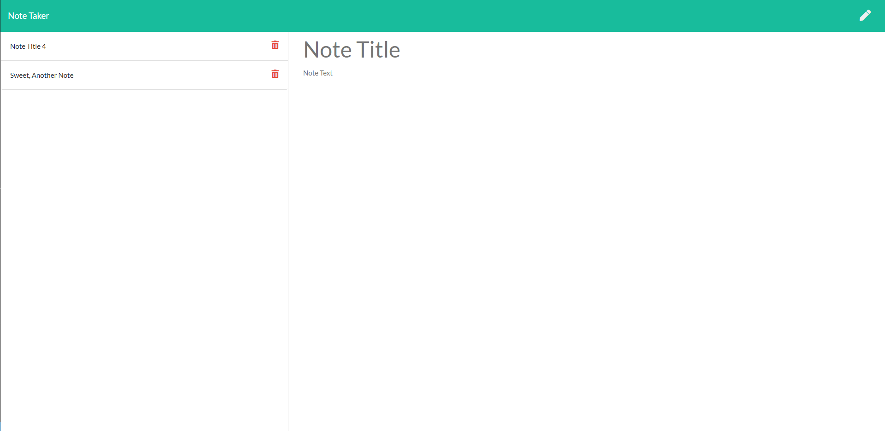

# Note Taker

## Description

Files to deploy an application that will write, save, and delete notes.
* Application frontend constructed using HTML/CSS/JS.
* Backend storing data using a json file
* Express used to connect to json and make GET/POST/DELETE requests

## Table of Contents
* [Installation](#installation)
* [Usage](#usage)
* [License](#license)
* [Contributing](#contributing)
* [Tests](#tests)
* [Questions](#questions)

##  Installation

* Fork from the GitHub Repository: [https://github.com/Udunomancer/gt-ft-note-taker](https://github.com/Udunomancer/gt-ft-note-taker)
* Push to a Heroku instance

##  Usage

* The program should present the user with an html file
  * index.html should present a home page with links to the notes.html.
  * notes.html should present an interactive page.
* On notes.html the user should be able to
  * Click on a note in the left hand menu to display it
  * Click on the pencil icon on the top right to add new note values, and the save icon to add it
  * Click on the delete icon to remove a saved note

##  License

[The MIT License](https://opensource.org/licenses/MIT)

##  Contributing

No public contributions accepted in this repository at this time.
If issues are found, please contact me using gmail/GitHub profile found in the Questions section below.

##  Tests

To confirm functionality:
* All notes listed on db.json should be displayed on notes.html
* Adding a new note should save the note data to db.json and display the new note on the page
* Deleting a note should remove the note data from db.json and remove the note from the page display

##  Questions

Have questions?
* View my GitHub Profile: [https://github.com/Udunomancer](https://github.com/Udunomancer)
* Email me at: [kyle717@gmail.com](mailto:kyle717@gmail.com)